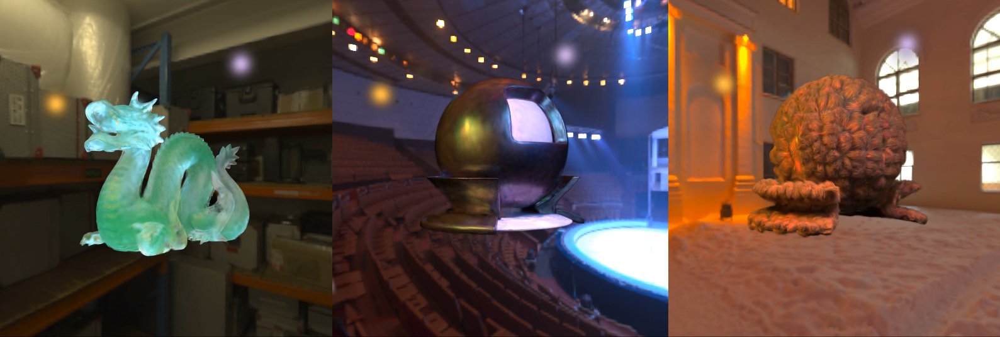

# [3DV 2025] BiGS: Bidirectional Primitives for Relightable 3D Gaussian Splatting



Code release for _BiGS: Bidirectional Primitives for Relightable 3D Gaussian Splatting_, 3D Vision 2025; Liu Zhenyuan, Guo Yu, Xinyuan Li, Bernd Bickel, Ran Zhang.

Train relightable Gaussian splats with OLAT (one-light-a-time) datasets, and relight with environmet maps and point lights in real time.

For more details, check out our [project page](https://desmondlzy.me/publications/bigs/) and our [paper](https://www.arxiv.org/abs/2408.13370).

## Install

The code is tested on Ubuntu 20.04, CUDA 12.2. Please clone the repo and create a [conda](https://docs.anaconda.com/miniconda/) environment with `environment.yml`. 

```shell
git clone git@github.com:desmondlzy/bigs.git && cd bigs
conda env create -f environment.yml
```

## Training

Assume the data is already downloaded and unzipped into `data/bigs` directory

The training has two steps: (1) train a normal Gaussian Splat model, preferrably using datasets with neutral lighting condition; (2) train the lighting components using OLAT data.

_Step 1_: Train a Gaussian Splats model. 
here we use a customized tweaked version of `splatfacto` method provided by `nerfstudio`.
You could also use `splatfacto` or other splatting methods by [writing your own nerfstudio extension](https://docs.nerf.studio/developer_guides/new_methods.html) for `splatfacto`, your model class would need to subclass `SplatfactoModel`.

```shell
ns-train mask-splat \
    --experiment-name dragon\
    --pipeline.model.cull-alpha-thresh 0.005 \
	--pipeline.model.random-scale 1.2 \
	bigs-blender \
	--data data/bigs/dragon/olat_all_on/
```

_Step 2_: Invoke the training script for the relightablity training. On our nvidia A100 GPU, training 100K iteration takes around 1.5 hours to complete.

```shell
python scripts/training.py \
    --dataset-root data/bigs/dragon \
	--ns-gaussian-config outputs/dragon/mask-splat/<config-path>/config.yml \
	--output-path ./bigs-output/dragon/training
```

After running this script, the BiGS checkpoint can be found in `bigs-output/dragon/training` directory, named with `model_{iter}.pth`.

## Relighting & Eval

Then we load the trained BiGS model, and render it under a new lighting conditions.
You could also skip the training step and use our pretrained model checkpoint (download here).

Run the `point_relight.py` for relighting with a point light source.
You can find the rendered videos and a json file containing the metrics in the the output path directory after the script finishes.
```shell
python scripts/point_relight.py \
	--dataset-root data/bigs/dragon \
	--checkpoint-path ./bigs-output/dragon/training/model_100000.pth \
	--output-path ./bigs-output/dragon/point-relight
```

Run the `envmap_relight.py` for relighting with an environment map. An example envmap is provided in `data/envmaps/gear-store.exr`.
You can find the rendered videos in the the output path directory after the script finishes.
```shell
python scripts/envmap_relight.py \
    --dataset-root data/bigs/dragon \
	--checkpoint-path bigs-output/dragon/training/model_100000.pth \
	--output-path bigs-output/dragon/envmap-relight \
	--envmap data/envmaps/gear-store.exr
```

## Acknowledgments

We thank Andreas Mischok for the envmap `peppermint-powerplant` ([polyhaven.com](https://polyhaven.com/a/peppermint_powerplant_2), CC0);
Dimitrios Savva and Jarod Guest for the envmap `gear-store` ([polyhaven.com](https://polyhaven.com/a/gear_store), CC0);
Authors of [`gsplat`](https://github.com/nerfstudio-project/gsplat) for developing the amazing package.
Our synthetic data is generated using [Mitsuba](https://mitsuba.readthedocs.io/en/stable/);
Special thanks to Changxi Zheng for supporting the internship program at Tencent Pixel Lab.